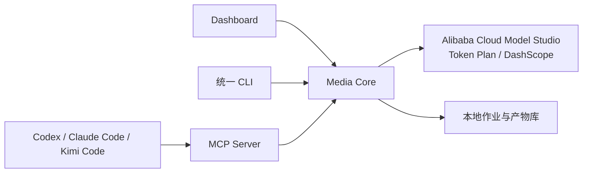

# Token Plan Media Hub

面向 Codex、Claude Code、Kimi Code CLI 与其他 MCP 客户端的本地优先媒体生成控制台。

> 当前状态：产品定义与架构草案。尚未提供可运行的媒体服务。
>
> 本项目不是阿里云官方项目，也不绕过 Token Plan 的套餐、地域、额度或模型限制。

## 为什么不是“一批通用 Skill”

Skill 负责告诉 Agent **何时、为什么、怎样使用能力**，但不同 Agent 的 Skill 发现、安装和命令格式并不完全相同。真正可复用的生成能力必须放在一个与 Agent 无关的核心里：



各 Agent 只安装薄适配层；Dashboard、CLI 和 MCP 共用同一份模型注册表、密钥配置、任务状态和产物记录。即使 Agent 聊天记录被重置，项目状态仍保存在本地文件与数据库中。

## MVP

- 凭据中心：分别录入、说明并测试 Token Plan Key 与普通百炼 / Model Studio API Key。
- 显式路由：每个模型标注所用 Key，不在两类凭据之间自动回退或静默切换。
- 能力探测：区分“官方列出”“当前所选 Key 实测可用”“该路由不可用”。
- 模型中心：图片、视频、语音合成、声音复刻分别选择默认模型。
- 官方说明：显示来源 URL、验证日期、支持参数和限制，不硬编码营销文案。
- 测试工作台：提交任务、查看异步状态、预览和下载结果。
- 产物库：保存图片、视频、音频、克隆音色引用及生成清单。
- Agent 接入：MCP 为共同工具层，Skill/Plugin 负责发现和使用指引。

## 设计文档

- [产品规格](docs/product-spec.zh-CN.md)
- [完整用户故事](docs/user-stories.zh-CN.md)
- [用户流程图](docs/user-flows.zh-CN.md)
- [系统架构](docs/architecture.zh-CN.md)
- [安全与隐私边界](docs/security-and-privacy.zh-CN.md)
- [Dashboard 草稿说明](docs/wireframes/dashboard-concept.zh-CN.md)
- [官方来源与事实基线](docs/source-baseline.zh-CN.md)

## 计划中的仓库结构

```text
apps/dashboard/                 本地 Web 控制台
packages/core/                  任务、模型、产物和策略核心
packages/cli/                   面向用户和脚本的稳定 CLI
packages/mcp-server/            Agent 可调用的 MCP 工具
providers/aliyun-token-plan/    Token Plan / DashScope 适配
adapters/codex/                 Codex Plugin + Skills
adapters/claude-code/           Claude Code Skill / Command / MCP 安装器
adapters/kimi-code/             Kimi Plugin / Skill / MCP 安装器
model-registry/                 有来源、可版本化的模型目录
docs/                           产品与架构文档
```

## 公开仓库安全规则

- 永不提交 API Key、鉴权头、克隆音色 ID、原始声音样本或私人生成产物。
- Key 默认保存到操作系统凭据库；开发环境才允许使用环境变量。
- 声音复刻必须记录授权确认，且默认不公开原始录音。
- 每个生成结果写入独立 manifest，包含模型、参数、来源、时间和文件哈希。

## 许可证

MIT。第三方模型、服务和生成内容仍受各自条款约束。
