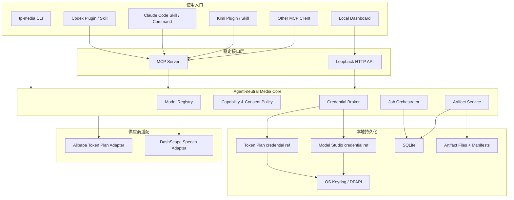
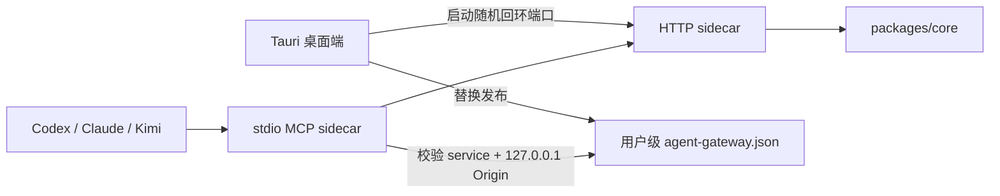

# 系统架构

## 核心结论

跨 Agent 的共同协议选 MCP，Skill 只是上层说明。Codex、Claude Code 与 Kimi Code CLI 都可以连接 MCP；Kimi 还支持把 Skill 与 MCP 声明打包为 Plugin。



## 分层职责

| 模块 | 负责 | 不负责 |
|---|---|---|
| Agent Skill | 触发语义、使用指导、安全提醒 | API 请求、Key、任务状态 |
| MCP Server | 稳定工具 Schema、权限边界、结构化错误 | 供应商特有字段散落 |
| Media Core | 校验、路由、任务、产物、审计 | Agent 私有配置格式 |
| Model Registry | 模型、能力、参数、来源、验证状态 | 保存用户 Key |
| Provider Adapter | 官方端点、请求/响应转换、轮询 | UI 和 Agent 逻辑 |
| Dashboard | 配置、选择、测试、预览、安装向导 | 成为第二套媒体实现 |

## Agent Gateway 与端口发现



发现优先级为显式 Origin、环境变量、发现文件、开发回退。发现文件只包含 Schema 版本、服务标识、回环 Origin、桌面 PID 和启动时间，不含 Key、Authorization Header 或媒体路径；桌面进程退出时只删除自己发布的内容。

## 双 Key 路由契约

`Credential Broker` 不实现 fallback chain。它只解析已经由用户或模型偏好确定的 `credentialMode`：

| `credentialMode` | UI 名称 | 行为 |
|---|---|---|
| `token_plan` | Token Plan Key | 仅读取 Token Plan credential reference |
| `token_plan_probe` | Token Plan Key（需探测） | 使用 Token Plan Key 做低成本能力探测；失败不改用其他 Key |
| `dashscope` | Model Studio API Key（普通百炼 Key） | 仅读取普通百炼 credential reference |

模型偏好必须保存 `model_id + capability + credential_mode`。任务提交时将 `credential_mode` 写入 manifest，但不写入 Key、Key 尾号或鉴权头。若所选凭据不存在、验证失败或模型不支持该路由，核心返回结构化错误并要求用户重新选择。

## Provider-neutral contracts

### Job

```json
{
  "id": "job_...",
  "capability": "image.generate",
  "model": "wan2.7-image",
  "status": "queued",
  "client": {
    "kind": "mcp",
    "name": "codex"
  },
  "providerTaskId": null,
  "artifactIds": [],
  "createdAt": "ISO-8601",
  "updatedAt": "ISO-8601"
}
```

### 错误分类

```text
AUTH_INVALID
REGION_UNAVAILABLE
PLAN_UNSUPPORTED
MODEL_UNAVAILABLE
PARAMETER_INVALID
CONSENT_REQUIRED
PROVIDER_REJECTED
JOB_TIMEOUT_UNKNOWN
DOWNLOAD_FAILED
LOCAL_DEPENDENCY_MISSING
```

超时必须使用 `JOB_TIMEOUT_UNKNOWN`，不能当作失败或成功；如果有 provider task ID，用户可以继续查询。

## Agent 包装策略

| Agent | 主要工具层 | 包装层 |
|---|---|---|
| Codex | MCP | Plugin 中的 Skills + MCP 声明 |
| Claude Code | MCP | Skill/Slash Command + 安装器 |
| Kimi Code CLI | MCP（stdio/HTTP） | Plugin 或 Agent Skill；项目级 `.kimi-code/mcp.json` |
| 未知 Agent | CLI/HTTP/MCP | 可选的薄说明文件 |

## 本地状态

```text
config.db
  credential_refs
  model_preferences
  capability_probes
  jobs
  artifacts
  consent_records

artifacts/
  <yyyy>/<mm>/<job-id>/
    request.json
    response-summary.json
    manifest.json
    output.<ext>
```

数据库与文件系统使用写临时文件、校验、原子改名、最后提交数据库的顺序，避免出现数据库记录成功但文件缺失。
