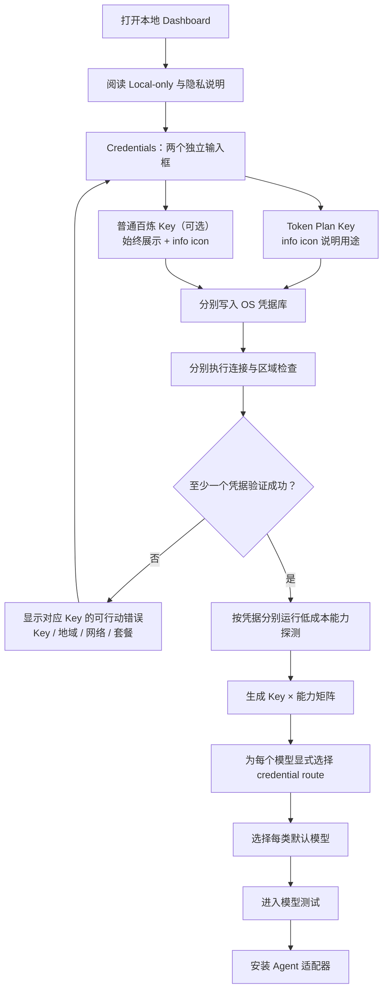
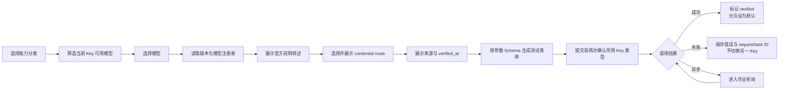
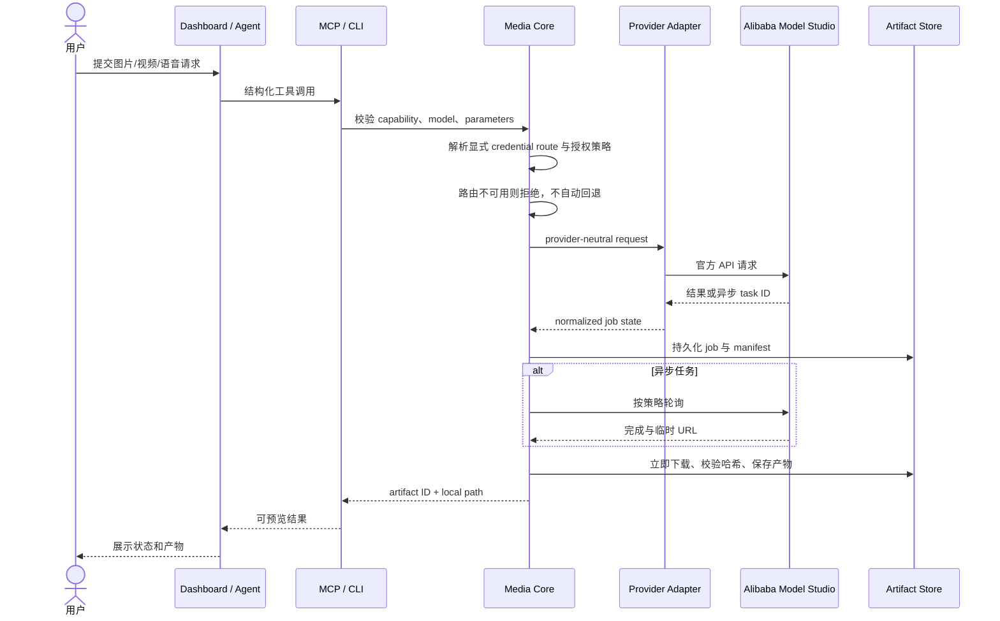
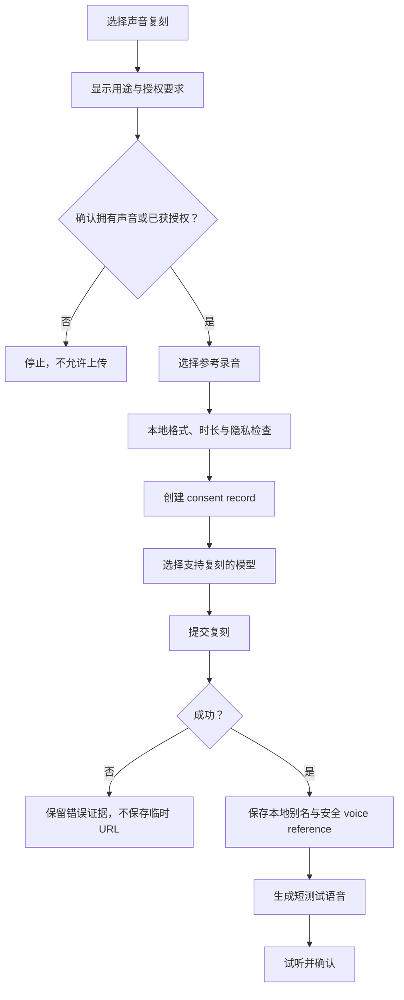
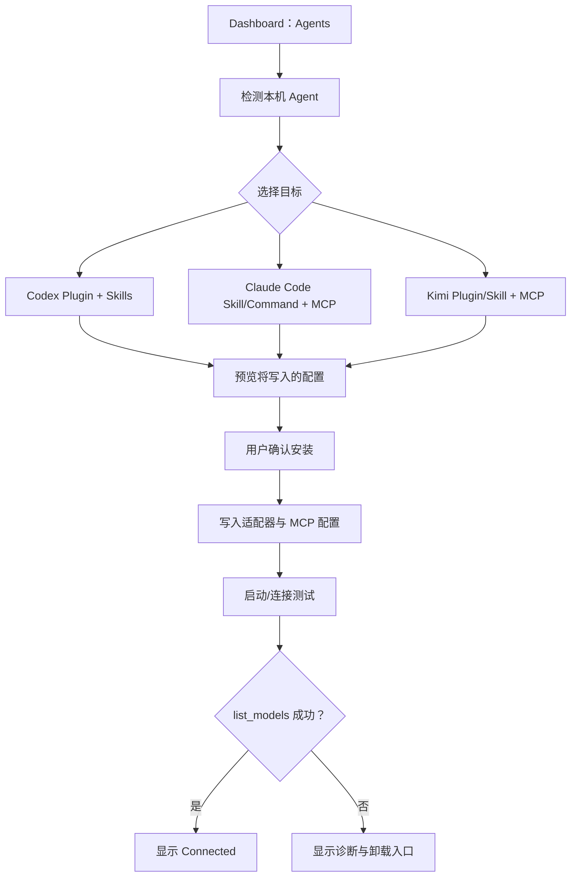

# 用户流程图

## 1. 首次设置

```mermaid
flowchart TD
    A["打开本地 Dashboard"] --> B["阅读 Local-only 与隐私说明"]
    B --> C["Credentials：两个独立输入框"]
    C --> D["Token Plan Key<br/>info icon 说明用途"]
    C --> E["普通百炼 Key（可选）<br/>始终展示 + info icon"]
    D --> F["分别写入 OS 凭据库"]
    E --> F
    F --> G["分别执行连接与区域检查"]
    G --> H{"至少一个凭据验证成功？"}
    H -- 否 --> I["显示对应 Key 的可行动错误<br/>Key / 地域 / 网络 / 套餐"]
    I --> C
    H -- 是 --> J["按凭据分别运行低成本能力探测"]
    J --> K["生成 Key × 能力矩阵"]
    K --> L["为每个模型显式选择 credential route"]
    L --> M["选择每类默认模型"]
    M --> N["进入模型测试"]
    N --> O["安装 Agent 适配器"]
```

## 2. 模型选择与测试

```mermaid
flowchart LR
    A["选择能力分类"] --> B["筛选当前 Key 可用模型"]
    B --> C["选择模型"]
    C --> D["读取版本化模型注册表"]
    D --> E["展示官方说明转述"]
    E --> F["选择并展示 credential route"]
    F --> G["展示来源与 verified_at"]
    G --> H["按参数 Schema 生成测试表单"]
    H --> I["提交前再次确认所用 Key 类型"]
    I --> J{"调用结果"}
    J -- 成功 --> K["标记 verified<br/>允许设为默认"]
    J -- 失败 --> L["保存错误与 request/task ID<br/>不切换另一 Key"]
    J -- 异步 --> M["进入作业轮询"]
    M --> J
```

## 3. Dashboard 或 Agent 发起媒体任务

```mermaid
sequenceDiagram
    actor U as 用户
    participant X as Dashboard / Agent
    participant M as MCP / CLI
    participant C as Media Core
    participant P as Provider Adapter
    participant A as Alibaba Model Studio
    participant S as Artifact Store

    U->>X: 提交图片/视频/语音请求
    X->>M: 结构化工具调用
    M->>C: 校验 capability、model、parameters
    C->>C: 解析显式 credential route 与授权策略
    C->>C: 路由不可用则拒绝，不自动回退
    C->>P: provider-neutral request
    P->>A: 官方 API 请求
    A-->>P: 结果或异步 task ID
    P-->>C: normalized job state
    C->>S: 持久化 job 与 manifest
    alt 异步任务
        C->>A: 按策略轮询
        A-->>C: 完成与临时 URL
    end
    C->>S: 立即下载、校验哈希、保存产物
    C-->>M: artifact ID + local path
    M-->>X: 可预览结果
    X-->>U: 展示状态和产物
```

## 4. 声音复刻

```mermaid
flowchart TD
    A["选择声音复刻"] --> B["显示用途与授权要求"]
    B --> C{"确认拥有声音或已获授权？"}
    C -- 否 --> D["停止，不允许上传"]
    C -- 是 --> E["选择参考录音"]
    E --> F["本地格式、时长与隐私检查"]
    F --> G["创建 consent record"]
    G --> H["选择支持复刻的模型"]
    H --> I["提交复刻"]
    I --> J{"成功？"}
    J -- 否 --> K["保留错误证据，不保存临时 URL"]
    J -- 是 --> L["保存本地别名与安全 voice reference"]
    L --> M["生成短测试语音"]
    M --> N["试听并确认"]
```

## 5. Agent 安装

```mermaid
flowchart TD
    A["Dashboard：Agents"] --> B["检测本机 Agent"]
    B --> C{"选择目标"}
    C --> D["Codex Plugin + Skills"]
    C --> E["Claude Code Skill/Command + MCP"]
    C --> F["Kimi Plugin/Skill + MCP"]
    D --> G["预览将写入的配置"]
    E --> G
    F --> G
    G --> H["用户确认安装"]
    H --> I["写入适配器与 MCP 配置"]
    I --> J["启动/连接测试"]
    J --> K{"list_models 成功？"}
    K -- 是 --> L["显示 Connected"]
    K -- 否 --> M["显示诊断与卸载入口"]
```
