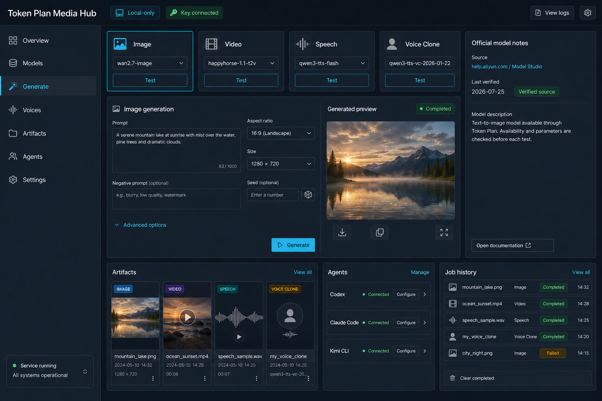
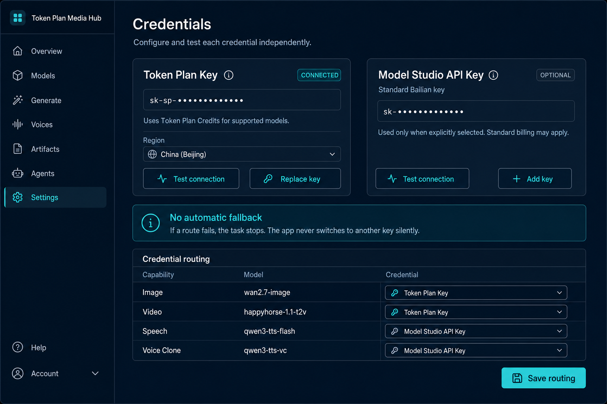

# Dashboard 概念稿说明

## 页面层级

| 区域 | 目的 |
|---|---|
| 顶部状态 | 强调 Local-only、凭据连接和服务状态 |
| 左侧导航 | Overview、Models、Generate、Voices、Artifacts、Agents、Settings |
| 能力卡 | 图片、视频、语音、复刻分别选择模型并测试 |
| 生成工作台 | 参数由所选模型 Schema 动态渲染 |
| 官方说明 | 来源、验证日期、能力转述和限制 |
| 产物区 | 图片、视频、波形、克隆音色的中间结果 |
| Agent 区 | Codex、Claude Code、Kimi CLI 的安装和连接状态 |
| 作业历史 | 异步任务、失败和完成状态 |
| Credentials 设置页 | 两个独立 Key 输入、info icon、连接测试和模型路由表 |

## 双 Key 交互

| 元素 | 设计意图 |
|---|---|
| Token Plan Key 卡片 | 独立保存与测试；info icon 说明 Token Plan Credits 与能力探测 |
| Model Studio API Key 卡片 | 始终展示但标记 Optional；独立保存与测试；info icon 说明普通百炼路由可能采用独立计费 |
| No automatic fallback | 明确声明任一调用失败后都不会改用另一 Key |
| Credential routing | 为每项能力/模型显示并选择实际使用的 Key |

## 草稿边界

- 这是信息架构和视觉方向稿，不是已经实现的页面。
- 图中示例图片、作业名和连接状态均为占位演示。
- 产品实现不得直接信任图中的参数，必须读取模型注册表。
- 任一“Connected”只表示对应凭据可读取；各模型在该路由下的可用性仍需单独探测。
- 图中遮罩 Key 为虚构占位符，不代表真实前缀规则。
